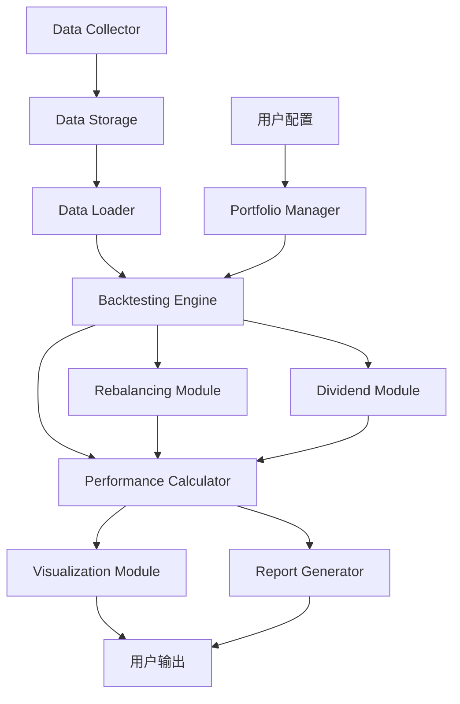

# 中国A股指数投资组合回测系统设计方案

## 1. 系统概述

### 1.1 目标
设计一个基于历史数据的投资组合回测系统，用于分析中国A股市场各类指数的投资表现，支持多种投资策略（再平衡、红利再投资等）。

### 1.2 技术栈
- **编程语言**: Python 3.8+
- **数据存储**: CSV文件
- **核心库**: pandas, numpy, matplotlib, seaborn, akshare
- **分析周期**: 10年历史数据回测

---

## 2. 数据获取方案

### 2.1 支持的指数列表

| 指数名称 | 指数代码 | 发布日期 | 数据来源 |
|---------|---------|---------|---------|
| 上证50 | 000016.SH | 2004-01-02 | akshare |
| 沪深300 | 000300.SH | 2005-04-08 | akshare |
| 中证1000 | 000852.SH | 2014-10-17 | akshare |
| 万得全A | 881001.WI | 1990-12-19 | Wind API/备选akshare |
| 创业板指 | 399006.SZ | 2010-06-01 | akshare |
| 科创板50 | 000688.SH | 2019-12-31 | akshare |
| 上证红利 | 000015.SH | 2005-01-04 | akshare |

### 2.2 数据获取方法

#### 方法1: 使用 AKShare (推荐 - 免费开源)
```python
import akshare as ak

def get_index_data(symbol, start_date, end_date):
    """
    获取指数日线数据
    symbol: 指数代码，如 'sh000016' (上证50)
    返回: DataFrame with columns [date, open, close, high, low, volume, amount]
    """
    df = ak.stock_zh_index_daily(symbol=symbol)
    df = df[(df['date'] >= start_date) & (df['date'] <= end_date)]
    return df
```

### 2.3 数据存储结构

```
data/
├── indices/
│   ├── 000016_SH_上证50.csv
│   ├── 000300_SH_沪深300.csv
│   └── metadata.json
├── dividends/
│   └── 000016_SH_dividends.csv
└── portfolios/
    ├── portfolio_config_001.json
    └── backtest_results_001.csv
```

---

## 3. 系统架构设计

### 3.1 系统架构图



### 3.2 核心模块

#### 3.2.1 数据采集模块 (Data Collector)
- 从AKShare获取指数数据
- 保存到CSV文件
- 支持批量更新

#### 3.2.2 投资组合配置模块 (Portfolio Configuration)
- 配置指数权重
- 设置再平衡策略
- 配置红利处理方式

#### 3.2.3 回测引擎 (Backtesting Engine)
- 逐日回测
- 支持再平衡
- 支持红利再投资

---

## 4. 核心功能实现

### 4.1 再平衡策略

**方法1: 日历再平衡**
- 按固定时间间隔（月度/季度/年度）调整持仓至目标权重

**方法2: 阈值再平衡**
- 当任一资产权重偏离目标权重超过阈值（如5%）时触发再平衡

### 4.2 红利处理

**选项1: 红利再投资**
- 分红自动购买该指数，增加持仓份额

**选项2: 现金分红**
- 分红存入现金池，不再投资

---

## 5. 绩效评估指标

### 5.1 收益指标
- **总收益率**: (期末市值 - 期初市值) / 期初市值
- **年化收益率**: ((1 + 总收益率) ^ (1 / 年数)) - 1

### 5.2 风险指标
- **年化波动率**: 日收益率标准差 × √252
- **最大回撤**: max((历史最高点 - 当前点) / 历史最高点)

### 5.3 风险调整收益指标
- **夏普比率**: (年化收益率 - 无风险利率) / 年化波动率
- **卡玛比率**: 年化收益率 / 最大回撤
- **索提诺比率**: (年化收益率 - 无风险利率) / 下行波动率

### 5.4 其他指标
- **胜率**: 正收益交易日数 / 总交易日数
- **盈亏比**: 平均盈利 / 平均亏损
- **持有期收益**: 按月/季度/年统计收益分布

---

## 6. 可视化与报告

### 6.1 图表类型

#### 6.1.1 净值曲线图
```python
import matplotlib.pyplot as plt

def plot_net_value_curve(portfolio_history):
    """
    绘制净值曲线
    """
    plt.figure(figsize=(12, 6))
    plt.plot(portfolio_history['date'], 
             portfolio_history['total_value'] / portfolio_history['total_value'].iloc[0])
    plt.title('组合净值曲线')
    plt.xlabel('日期')
    plt.ylabel('净值')
    plt.grid(True)
    plt.show()
```

#### 6.1.2 回撤曲线
```python
def plot_drawdown(portfolio_history):
    """
    绘制回撤曲线
    """
    values = portfolio_history['total_value']
    running_max = values.expanding().max()
    drawdown = (values - running_max) / running_max
    
    plt.figure(figsize=(12, 6))
    plt.fill_between(portfolio_history['date'], 0, drawdown, alpha=0.3, color='red')
    plt.title('回撤曲线')
    plt.xlabel('日期')
    plt.ylabel('回撤比例')
    plt.grid(True)
    plt.show()
```

#### 6.1.3 收益分布图
```python
def plot_return_distribution(portfolio_history):
    """
    绘制收益分布直方图
    """
    returns = portfolio_history['total_value'].pct_change().dropna()
    
    plt.figure(figsize=(10, 6))
    plt.hist(returns, bins=50, alpha=0.7, edgecolor='black')
    plt.axvline(returns.mean(), color='r', linestyle='dashed', linewidth=2, label='平均收益')
    plt.title('日收益率分布')
    plt.xlabel('收益率')
    plt.ylabel('频数')
    plt.legend()
    plt.grid(True)
    plt.show()
```

#### 6.1.4 权重变化图
```python
def plot_weight_evolution(portfolio_history):
    """
    绘制权重变化堆叠面积图
    """
    plt.figure(figsize=(12, 6))
    
    for index_code in portfolio_history.columns:
        if index_code not in ['date', 'total_value']:
            plt.fill_between(portfolio_history['date'], 
                           portfolio_history[index_code], 
                           label=index_code, 
                           alpha=0.7)
    
    plt.title('组合权重变化')
    plt.xlabel('日期')
    plt.ylabel('权重')
    plt.legend()
    plt.grid(True)
    plt.show()
```

### 6.2 报告生成

#### 绩效报告示例
```
====================================
投资组合回测报告
====================================

基本信息:
- 组合名称: 均衡配置组合
- 回测期间: 2014-01-01 至 2024-01-01
- 初始资金: ¥1,000,000
- 再平衡方式: 季度再平衡

持仓配置:
- 上证50:    30.0%
- 沪深300:   30.0%
- 中证1000:  20.0%
- 创业板指:  20.0%

收益指标:
- 总收益率:     85.32%
- 年化收益率:   6.42%
- 期末市值:     ¥1,853,200

风险指标:
- 年化波动率:   18.65%
- 最大回撤:     -28.45%
- 夏普比率:     0.32

其他指标:
- 胜率:         54.2%
- 交易次数:     40次
- 总交易成本:   ¥12,450

====================================
```

---

## 7. 项目结构

```
portfolio_backtest/
├── data/
│   ├── indices/
│   ├── dividends/
│   └── portfolios/
├── src/
│   ├── __init__.py
│   ├── data_collector.py      # 数据采集
│   ├── data_loader.py          # 数据加载
│   ├── portfolio_config.py     # 组合配置
│   ├── backtest_engine.py      # 回测引擎
│   ├── rebalancing.py          # 再平衡策略
│   ├── dividend_handler.py     # 红利处理
│   ├── performance.py          # 绩效计算
│   ├── visualization.py        # 可视化
│   └── report_generator.py     # 报告生成
├── examples/
│   ├── example_config.json
│   └── run_backtest.py
├── tests/
│   └── test_backtest.py
├── requirements.txt
└── README.md
```

---

## 8. 使用示例

### 8.1 创建投资组合配置

```python
from src.portfolio_config import PortfolioConfig

# 创建配置
config = PortfolioConfig()
config.initial_capital = 1000000
config.start_date = '2014-01-01'
config.end_date = '2024-01-01'

# 添加指数
config.add_index('000016.SH', 0.30)  # 上证50
config.add_index('000300.SH', 0.30)  # 沪深300
config.add_index('000852.SH', 0.20)  # 中证1000
config.add_index('399006.SZ', 0.20)  # 创业板指

# 设置再平衡
config.rebalance_frequency = 'quarterly'
config.rebalance_method = 'calendar'

# 设置红利再投资
config.dividend_reinvest = True

# 保存配置
config.save_config('data/portfolios/my_portfolio.json')
```

### 8.2 运行回测

```python
from src.data_loader import DataLoader
from src.backtest_engine import BacktestEngine
from src.portfolio_config import PortfolioConfig
from src.visualization import Visualizer
from src.report_generator import ReportGenerator

# 加载配置
config = PortfolioConfig.load_config('data/portfolios/my_portfolio.json')

# 创建数据加载器
data_loader = DataLoader(data_dir='./data')

# 创建回测引擎
engine = BacktestEngine(config, data_loader)

# 运行回测
results = engine.run_backtest()

# 生成可视化
viz = Visualizer(results)
viz.plot_net_value_curve()
viz.plot_drawdown()
viz.plot_return_distribution()
viz.plot_weight_evolution()

# 生成报告
reporter = ReportGenerator(results, config)
reporter.generate_html_report('reports/backtest_report.html')
reporter.print_summary()
```

### 8.3 数据更新

```python
from src.data_collector import DataCollector

# 创建数据采集器
collector = DataCollector(data_source='akshare')

# 更新单个指数
collector.fetch_and_save('000016.SH', '2020-01-01', '2024-01-01')

# 批量更新所有指数
collector.update_all_indices()
```

---

## 9. 依赖库

```txt
# requirements.txt
pandas>=1.3.0
numpy>=1.21.0
matplotlib>=3.4.0
seaborn>=0.11.0
akshare>=1.10.0
```

安装命令:
```bash
pip install -r requirements.txt
```

---

## 10. 实施路线图

### 阶段1: 基础框架
1. 实现数据采集模块
2. 实现数据存储和加载
3. 创建基本的投资组合配置

### 阶段2: 核心回测
4. 实现回测引擎主循环
5. 实现再平衡策略
6. 实现红利处理机制

### 阶段3: 绩效分析
7. 实现绩效指标计算
8. 创建可视化图表
9. 生成回测报告

### 阶段4: 优化与扩展
10. 性能优化
11. 增加更多策略选项
12. 添加单元测试

---

## 11. 注意事项

### 11.1 数据质量
- 确保数据完整性，处理缺失值
- 注意数据对齐问